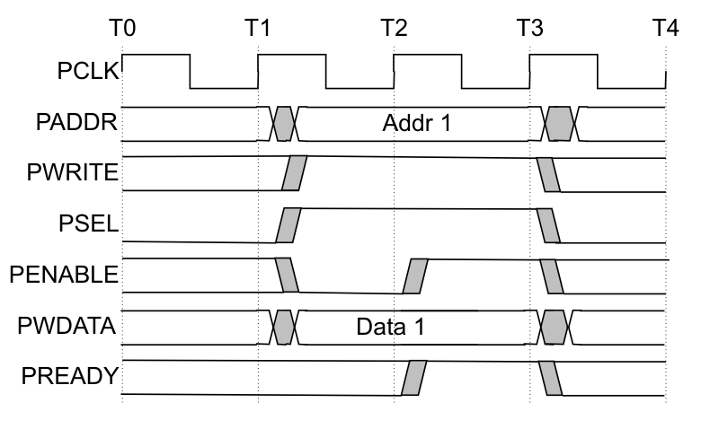
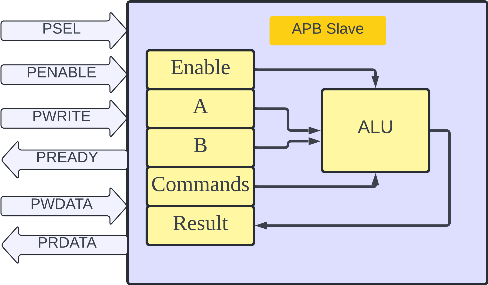
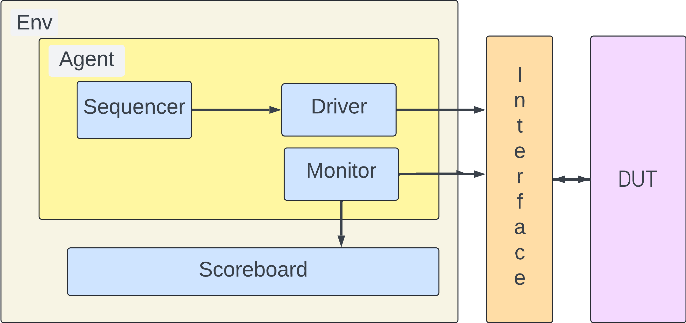
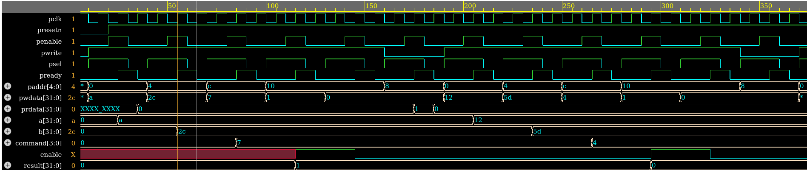

# UVM-Test-Bench-For-APB-Protocol
This project features a comprehensive UVM testbench designed to validate the functionality and performance of the APB slave... 
- To simulate the EDA playground  

[](https://www.edaplayground.com/x/LtAb)


### Key Features
- **Register Model:** Models the APB slave with 5 registers: A, B, Command, Result, and Enable.
- **Functional Coverage:** Implements coverage points to verify all functional aspects of the APB protocol.
- **Randomized Transactions:** Generates random APB transactions to test various scenarios and edge cases.


# APB Protocol:
- APB is a low bandwidth and low-performance bus. So, the components requiring lower bandwidth, like the peripheral devices such as UART, Keypad, Timer, and PIO (Peripheral Input Output) devices, are connected to the APB. The bridge connects the high-performance AHB or ASB bus to the APB bus. So, for APB, the bridge acts as the master, and all the devices connected to the APB bus act as the slave.


Here is a simplified timing diagram for the APB read operation:

### Key Signals:
- **PADDR:** Address bus carrying the address of the register to be read.
- **PSELx:** Select signal for the target slave.
- **PENABLE:** Enable signal indicating the access phase.
- **PWRITE:** Write a signal indicating the type of operation (0 for read).
- **PREADY:** Ready signal indicating the slave is ready with the data.
- **PRDATA:** Read data bus carrying the data from the slave to the master.

This process ensures that the master can read data from the desired register within the APB slave efficiently and reliably.

 
# APB Read operation:

- Initiating a write operation in APB involves a handshake between the master and slave. The master asserts the `PSEL` signal to select the target slave, placing the write address on the `PADDR` bus and the data on the `PWDATA` bus. It then activates the `PWRITE` signal to indicate a write operation and raises the PENABLE signal to initiate the transfer. The slave acknowledges its readiness by asserting the `PREADY` signal. Once the data transfer is complete, the slave de-asserts `PREADY`on the next clock cycle. The master acknowledges completion by de-asserting both `PENABLE` and `PSEL` signals, finalizing the write operation using these designated APB signals.




# APB Write Operation:

- Similarly to the Write operation, the Read operation has the exact mechanism only difference is the `PWRITE` signal will be low during this operation, and the slave will push the data to the `PRWRITE`


- The above image shows the write operation of APB protocol.


# APB Bus Slave DUT Explanation

- The DUT is an APB slave. The slave contains 5 registers and an ALU:
  1. **A**
  2. **B**
  3. **Command**
  4. **Result**
  5. **Enable**

- Using the APB protocol, data is written into the registers. The ALU takes the two operands from registers A and B, and based on the command, performs the calculation. It then stores the resultant value in the Result register. The ALU updates the Result register only when the Enable register value is High.
 


# UVM Testbench for APB

## Overview
The Universal Verification Methodology (UVM) is a powerful standard framework for verifying complex digital designs.UVM excels in creating reusable and scalable verification environments.

- **Reusability:** UVM promotes creating modular components that can be reused across verification projects. 
- **Scalability:** The UVM approach allows you to quickly adapt your testbench to accommodate growing design complexity.
- **Standardization:** UVM provides a standardized methodology for verification component creation, improving code readability and maintainability.
 
## Testbench Components




## Register Abstraction Model:

- The Register Abstraction Layer (RAL) is a key component in the Universal Verification Methodology (UVM) that simplifies verifying register-based interfaces in digital designs. It provides a high-level abstraction for defining and interacting with registers, making verification more efficient and manageable.


# Testbench hierarchy:
```
 KERNEL: -------------------------------------------------------------------
# KERNEL: Name             Type           Size  Value                        
# KERNEL: -------------------------------------------------------------------
# KERNEL: regmodel         RegModel       -     @398                         
# KERNEL:   mod_reg        module_reg     -     @401                         
# KERNEL:     a            a_reg          -     @412                         
# KERNEL:       data       uvm_reg_field  ...    RW a[31:0]=32'h00000000     
# KERNEL:     b            b_reg          -     @418                         
# KERNEL:       data       uvm_reg_field  ...    RW b[31:0]=32'h00000000     
# KERNEL:     result       result_reg     -     @424                         
# KERNEL:       data       uvm_reg_field  ...    RO result[31:0]=32'h00000000
# KERNEL:     command      command_reg    -     @430                         
# KERNEL:       data       uvm_reg_field  ...    RW command[3:0]=4'h0        
# KERNEL:     enable       enable_reg     -     @436                         
# KERNEL:       data       uvm_reg_field  ...    RW enable[0:0]=1'h0         
# KERNEL:     uvm_reg_map  uvm_reg_map    -     @439                         
# KERNEL:       endian                    ...   UVM_LITTLE_ENDIAN            
# KERNEL:       a          a_reg          ...   @412 +'h0                    
# KERNEL:       b          b_reg          ...   @418 +'h4                    
# KERNEL:       result     result_reg     ...   @424 +'h8                    
# KERNEL:       command    command_reg    ...   @430 +'hc                    
# KERNEL:       enable     enable_reg     ...   @436 +'h10                   
# KERNEL:   apb_map        uvm_reg_map    -     @400                         
# KERNEL:     endian                      ...   UVM_LITTLE_ENDIAN            
# KERNEL:     uvm_reg_map  uvm_reg_map    -     @439                         
# KERNEL:       endian                    ...   UVM_LITTLE_ENDIAN            
# KERNEL:       a          a_reg          ...   @412 +'h0                    
# KERNEL:       b          b_reg          ...   @418 +'h4                    
# KERNEL:       result     result_reg     ...   @424 +'h8                    
# KERNEL:       command    command_reg    ...   @430 +'hc                    
# KERNEL:       enable     enable_reg     ...   @436 +'h10                   
# KERNEL: -------------------------------------------------------------------
# KERNEL: UVM_INFO /home/build/vlib1/vlib/uvm-1.2/src/base/uvm_root.svh(583) @ 0: reporter [UVMTOP] UVM testbench topology:
# KERNEL: --------------------------------------------------------------
# KERNEL: Name                       Type                    Size  Value
# KERNEL: --------------------------------------------------------------
# KERNEL: uvm_test_top               test                    -     @341 
# KERNEL:   SCO                      sco                     -     @368 
# KERNEL:     analysis_imp           uvm_analysis_imp        -     @378 
# KERNEL:   env                      env                     -     @354 
# KERNEL:     AGENT                  agent                   -     @388 
# KERNEL:       DRV                  driver                  -     @446 
# KERNEL:         rsp_port           uvm_analysis_port       -     @465 
# KERNEL:         seq_item_port      uvm_seq_item_pull_port  -     @455 
# KERNEL:       MON                  monitor                 -     @475 
# KERNEL:         analysis_port      uvm_analysis_port       -     @623 
# KERNEL:       SEQ                  uvm_sequencer           -     @484 
# KERNEL:         rsp_export         uvm_analysis_export     -     @493 
# KERNEL:         seq_item_export    uvm_seq_item_pull_imp   -     @611 
# KERNEL:         arbitration_queue  array                   0     -    
# KERNEL:         lock_queue         array                   0     -    
# KERNEL:         num_last_reqs      integral                32    'd1  
# KERNEL:         num_last_rsps      integral                32    'd1  
# KERNEL:
```

# Waveform:



# Coverage Report:

```
 +++++++++++++++++++++++++++++++++++++++++++++
# ++++++++++       DESIGN UNITS      ++++++++++
# +++++++++++++++++++++++++++++++++++++++++++++
# 
# 
# CUMULATIVE SUMMARY
# =============================================
# |    Coverage Type    | Weight | Hits/Total |
# =============================================
# | Covergroup Coverage |      1 |   100.000% |
# |---------------------|--------|------------|
# | Types               |        |      1 / 1 |
# =============================================
# CUMULATIVE DESIGN-BASED COVERAGE: 100.000%
# COVERED DESIGN UNITS: 1 / 1
# FILES: 1
# 
# 
# CLASS - work.monitor
# 
# 
#     SUMMARY
#     =============================================
#     |    Coverage Type    | Weight | Hits/Total |
#     =============================================
#     | Covergroup Coverage |      1 |   100.000% |
#     |---------------------|--------|------------|
#     | Types               |        |      1 / 1 |
#     =============================================
#     WEIGHTED AVERAGE: 100.000%
# 
# 
#     COVERGROUP COVERAGE
#     ====================================================================
#     |            Covergroup            |   Hits   |  Goal /  | Status  |
#     |                                  |          | At Least |         |
#     ====================================================================
#     | TYPE /monitor/c                  | 100.000% | 100.000% | Covered |
#     ====================================================================
#     | INSTANCE cvr_axi                 | 100.000% | 100.000% | Covered |
#     |----------------------------------|----------|----------|---------|
#     | COVERPOINT cvr_axi::data.command | 100.000% | 100.000% | Covered |
#     |----------------------------------|----------|----------|---------|
#     | bin auto[0]                      |        9 |        1 | Covered |
#     | bin auto[1]                      |        6 |        1 | Covered |
#     | bin auto[2]                      |        6 |        1 | Covered |
#     | bin auto[3]                      |        6 |        1 | Covered |
#     | bin auto[4]                      |        6 |        1 | Covered |
#     | bin auto[5]                      |        6 |        1 | Covered |
#     | bin auto[6]                      |        6 |        1 | Covered |
#     | bin auto[7]                      |        6 |        1 | Covered |
#     | bin auto[8]                      |        6 |        1 | Covered |
#     | bin auto[9]                      |        6 |        1 | Covered |
#     | bin auto[10]                     |        6 |        1 | Covered |
#     | bin auto[11]                     |        4 |        1 | Covered |
#     | bin auto[12]                     |        6 |        1 | Covered |
#     | bin auto[13]                     |        6 |        1 | Covered |
#     | bin auto[14]                     |        6 |        1 | Covered |
#     | bin auto[15]                     |        6 |        1 | Covered |
#     |----------------------------------|----------|----------|---------|
#     | COVERPOINT cvr_axi::apbin.paddr  | 100.000% | 100.000% | Covered |
#     |----------------------------------|----------|----------|---------|
#     | bin a                            |       16 |        1 | Covered |
#     | bin b                            |       16 |        1 | Covered |
#     | bin command                      |       16 |        1 | Covered |
#     | bin enable                       |       16 |        1 | Covered |
#     |----------------------------------|----------|----------|---------|
#     | COVERPOINT cvr_axi::apbin.pwrite | 100.000% | 100.000% | Covered |
#     |----------------------------------|----------|----------|---------|
#     | bin auto[0]                      |       17 |        1 | Covered |
#     | bin auto[1]                      |       80 |        1 | Covered |
#     ====================================================================

```
  
